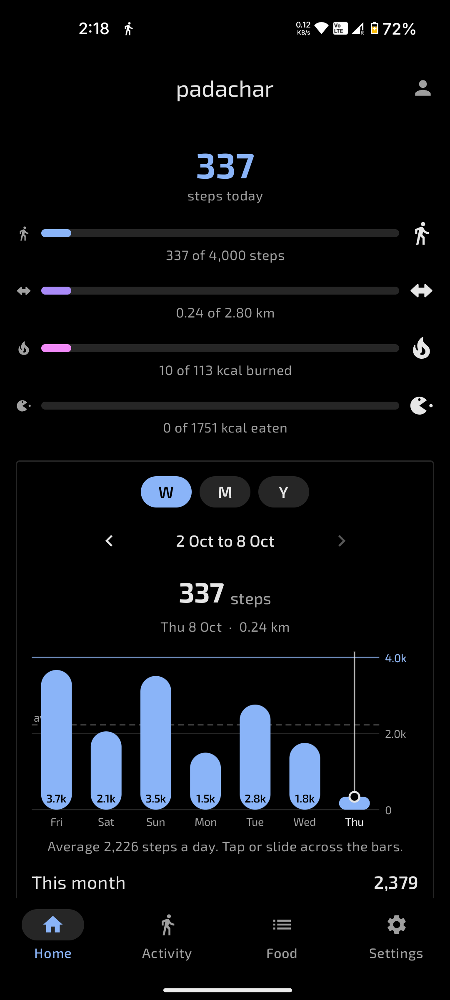
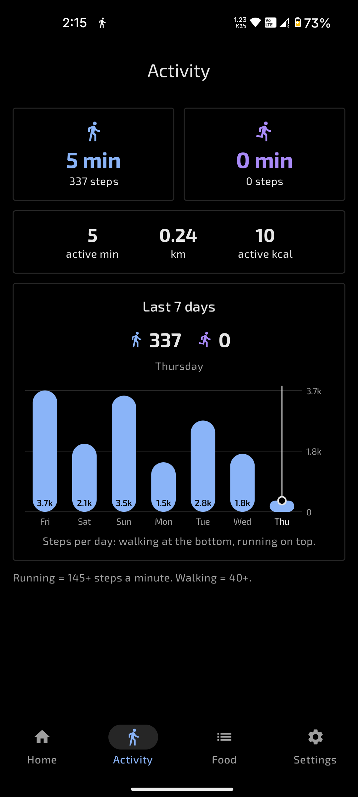
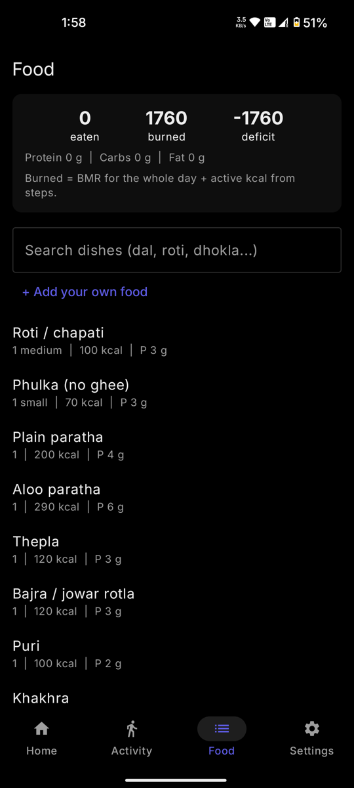
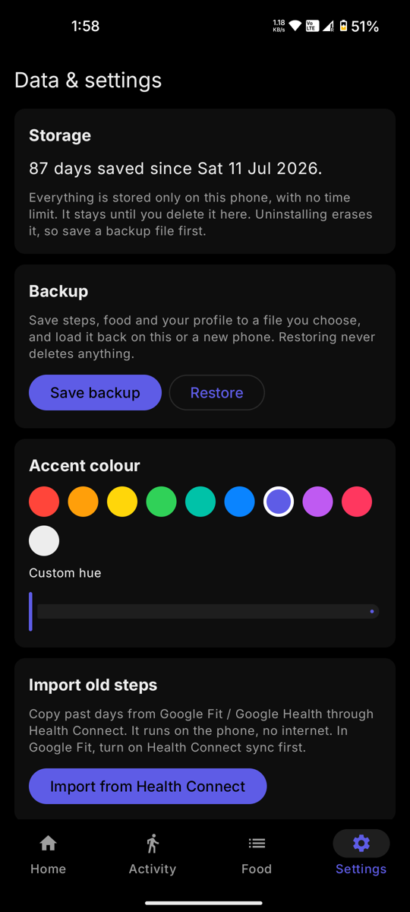
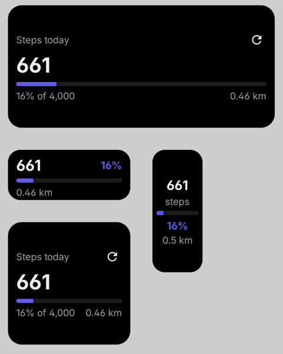

# padachar

*padachar* means walking on foot. An offline step and food tracker for Android (formerly StrideLocal). No internet permission, no ads, no account. Your data stays on your phone.

| Home | Activity | Food | Settings |
|:---:|:---:|:---:|:---:|
|  |  |  |  |

## Features

- Steps, distance and active calories from the phone's step sensor
- Walking vs running minutes
- Week, month and year charts with daily averages
- Food log with common Indian dishes, eaten vs burned, optional daily food goal
- Home screen widget (1x1 to 2x2)
- Optional move reminder, 7 am to 9 pm
- Backup to a file, import from Google Fit (Health Connect)
- Black theme with your own accent colour

## Install

1. Open [Releases](../../releases) on your phone.
2. Download the latest `Padachar-v...apk` and install it.
3. Set your profile and allow Physical activity.

If steps stop in the background, set the app's battery usage to Unrestricted.

## Build

Open in Android Studio and press Run, or `./gradlew assembleDebug`.

Kotlin, Jetpack Compose, Glance, Room, DataStore. Min Android 8, targets Android 15.

How the code is laid out: [HOW-IT-WORKS.md](HOW-IT-WORKS.md)
